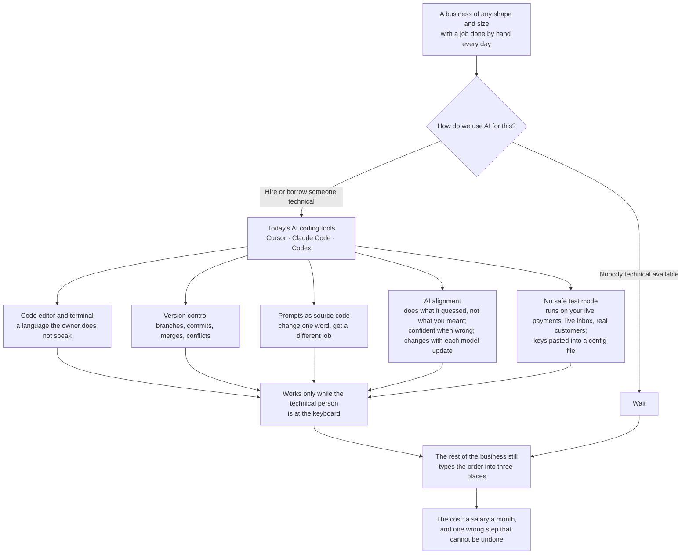
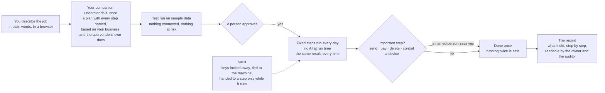

# Ductile AI: a safe AI companion for any business

**Ductile AI is an AI companion for your business.** It answers your questions from your live systems, and it takes over the jobs you do by hand, safely and for good.

You talk to it in plain words. Ask a question and it reads your apps right now and comes back with the answer and the evidence. Describe a job and it writes a step-by-step plan, shows you a test run on sample data, and waits for your approval. From that day on the job runs itself, the same way every time, across the apps you already use, and reports what it did. Your passwords and keys stay locked in a vault. Nothing important happens without a person saying yes. Every run leaves a clear record.

It fits a business of any shape and size: a one-person shop, an agency, a clinic, a distributor, a finance team, a utility. More than 1,000 apps and 5,000 ready-made actions are built in. From $25 a month.

---

## AI changed everything. The daily work did not move.

In two years, AI went from a demo to something every business is told it needs. It writes, reads, answers and summarises. Everyone says your competitors already use it. Some do.

Yet inside most businesses, the working day looks the same as before. The same order is typed into three systems. Unpaid invoices are chased by hand every Monday. The month-end report is rebuilt from exports nobody trusts. The tools got smarter. The work stayed where it was.

## Why the work stayed where it was

Ask a business owner, an operations manager or a finance lead. You hear the same three answers.

**"I don't know where to start."** The demos show a chatbot. My problem is a process with eleven steps, four systems and a person who has to approve it halfway through.

**"I don't trust it."** An AI that is brilliant on Monday and confidently wrong on Tuesday cannot go near the invoices. Nobody can tell me what it will do next time, or why it did what it did last time.

**"I'm afraid of what it can reach."** To do the work it needs my Stripe key, my Google Workspace admin login and my customers' details. Pasting those into a prompt or a config file is how a business ends up in the news.

So the bold ones hire someone technical, install a code editor and connect an AI assistant to their tools. It works, for that person, while they sit at the keyboard. Everyone else waits. Waiting is also a decision. It costs a salary a month.

## The problem in one picture



### A real example

A distributor with forty staff and one bookkeeper. Every Monday she exports the unpaid invoices from the accounting software, pastes them into a spreadsheet, writes a reminder to every customer more than thirty days late, and notes each one in the CRM. Four hours, every week.

Her nephew is good with computers. He installs an AI coding assistant, connects it to the accounting software and the mailbox, and by Sunday night it works. Then three things happen.

- **Week two.** It chases a customer who paid on Friday. The prompt said "over thirty days" but not "and still unpaid". Nobody can find the sentence to fix it.
- **Week four.** The AI model behind the assistant is updated. The emails come out in a different tone, and one goes to the wrong person. The nephew is back at university.
- **Week five.** The bookkeeper finds the accounting software's API key in a plain text file on the shared drive. That is where the assistant reads it from.

She goes back to four hours every Monday. Without anyone saying so, the business decides that AI is for other people.

The same story plays out at a hospital's prior-authorisation desk, a utility's outage room, an agency's month-end close and a one-person shop's order book. Different words, same problem.

### Why today's AI tools are hard for non-technical people

| Hurdle | What it means day to day |
|---|---|
| **Code editor and terminal** | The work happens in a programmer's editor and a command line. The person who knows the job has never opened either, and should not have to. |
| **Version control** | Every change is a commit on a branch that has to be merged. Git takes programmers years to master. For an operations manager it is a wall. |
| **Prompts as source code** | The job lives in a sentence. Change "over thirty days" to "thirty days or more" and a different set of customers gets emailed. Nothing warns you. |
| **AI alignment** | The model does the task it guessed, not always the one you meant. It sounds confident when it is wrong. It changes when the vendor ships a new version, without telling you. |
| **No safe test mode** | An assistant connected to your tools runs on live systems from day one: real invoices, real inboxes, real customers. One wrong step is a sent email or a charged card. |
| **Secrets** | To do the work, the assistant needs your keys. They end up in prompts, config files and chat logs, where a leak becomes a headline. |

None of this is a criticism of those tools. They are excellent for the people they were built for: developers. The problem is that the people who own the work are not developers, and the work will not wait.

## Enter Ductile AI

Ductile is the word engineers use for pipe that bends without breaking. Flexible enough to follow the way your business really works. Hardened so it does not crack under pressure. Sealed so nothing leaks. Built to carry a flow for years without anyone watching it.

That is what your AI companion is made of: **ductile process pipes** for your business goals and the daily work beneath them. AI at the start of the pipe, where understanding is needed. Fixed, hardened steps along its length, where trust is needed. A person at the valve, wherever the consequences are real.



Here is how it feels from your side of the desk.

**You describe the job in plain words.** "Every Monday, find invoices more than thirty days overdue, write a polite reminder for each, and list them for me." No editor. No code. No flowchart. A browser and a sentence, typed or spoken.

**Your companion understands it, once.** In seconds you get a complete plan with every step named. It never invents a step: it works from what it knows about your business and from each app vendor's own documentation, so every step is a real action on a real system. You read it the way you would read a new hire's plan, and change a word if one is wrong.

**You watch it run on sample data.** Nothing is connected. Nothing is at risk. You see exactly what would happen.

**You approve.** From then on the thinking is done. The job runs as fixed steps every Monday, the same way. Run it four hundred times and you get the same result four hundred times, because no AI model makes decisions at run time.

**Your passwords and keys never leave the vault.** Every key is locked in a vault, tied to the machine that uses it, and handed to a step only while that step runs. The plan, the AI and the record see names, never secrets.

**Nothing important happens without a person.** Anything that sends a message, moves money, deletes data or controls a device waits for a named person to say yes. Running a step twice is safe by design: it will not charge twice, send twice or write the same row twice.

**Every run tells you what it did**, step by step, in words the person who asked can read and words an auditor can read. Repeatable. Traceable. Boring, on purpose.

**And it is cheap to run**, because the expensive part, the thinking, happened once. From $25 a month.

## Ask it anything about your business

Your companion answers one-off questions the same way it runs jobs: it goes to your real systems, right now, and comes back with the answer and where it came from.

- *"How much is unpaid across Stripe and Xero this morning?"* It reads both, adds it up, and shows the invoices behind the number.
- *"Which orders placed this week have not shipped?"* It reads Shopify and the carrier, and lists them.
- *"What does this supplier's price page say today?"* It fetches the page at the address you give and reads it back.
- *"Who joined since Monday, and did they pay?"* It reads Whop or Paddle and the member list.

A question is read-only: nothing is changed, and every answer carries its evidence. If you like the answer, one click turns the question into a job that runs every morning.

## Everyday things it does

- **Reads the web for you.** Point it at a page, a price list, a public register or a competitor's catalogue. It fetches the page now, reads it, and hands the facts to the next step or to you.
- **Keeps your second brain.** Everything you tell it about your business, every document you give it and every answer it has already given stay in your own workspace. Answers come from your facts, not from the internet's guesses, and cite where each fact came from.
- **Writes the email and sends it.** A reminder, a quote, a weekly summary, drafted from your data and sent through Gmail to the right person, after you approve.
- **Tells the team.** A line in Slack or Microsoft Teams when an order lands, a payment fails or a job finishes. A message on WhatsApp, Telegram or by text when it matters more.
- **Fills the spreadsheet.** Rows into Excel or Google Sheets, the month-end sheet rebuilt from live figures, a table you can hand to finance.
- **Makes the deck and the document.** A Monday summary in Google Slides, a report in Google Docs, a PDF for the customer, built from the same facts every time.

## What is built in today

- **1,000+ apps and 5,000+ ready-made actions**: Salesforce, Stripe, Shopify, HubSpot, Google Workspace, Xero, QuickBooks, ClickUp, Slack, Microsoft Teams and many more. Every action is checked against the app vendor's own documentation before it ships.
- **Five ways a job can start**: a webhook from another system, a form someone fills in, a change in an app, a schedule, or a question you ask.
- **Runs where you need it**: in our cloud, or inside your own network when the data must not leave.

## Three Mondays

**The shop.** *"When a Shopify order is paid, create the invoice in Xero and post the day's total to #sales at 6 p.m."* Nobody types the order twice. Finance stops asking.

**The agency.** *"Every Monday, find invoices over 30 days late, draft a polite reminder in Gmail for each, and list them in ClickUp for me."* The reminders go out. The owner reads one line in Teams: *3 sent, $4,200 outstanding.*

**The membership business.** *"When someone pays on Whop or Paddle, add them to the Google Workspace group, drop a welcome note in their Obsidian folder, and tell me on Slack."* Onboarding takes zero minutes, forever.

## Forms you can put on your own website

Every form is hosted for you at `https://<your-label>-forms.ductileai.com/<slug>` and starts a process the moment it is sent. Four samples are in [`forms/`](forms/).

**Embed it with one line.** The script places the form in your page, sizes it to fit, and passes `utm_*` tags through as hidden fields:

```html
<script src="https://hooks.ductileai.com/forms/embed.js"
        data-form="https://acme-forms.ductileai.com/contact"
        data-pass="utm_source,utm_campaign" async></script>
```

**React when it is sent**, to show your own thank-you page or pass on the status link:

```html
<script>
  document.addEventListener('ductile-form:submitted', function (e) {
    console.log(e.detail.submissionId, e.detail.statusUrl);
  });
</script>
```

Add your website to the form's allowed list first, or the page will refuse to load inside another site. No other site can carry your form. Nothing a visitor types ever runs as code on the form page.

**Or skip the embed.** Share the link, or download the form as a phone app from the console's Share tab.

## Start with one Monday

Go to [ductileai.com](https://www.ductileai.com), open a workspace, and bring one job you do by hand every week. Ten minutes later it is running. From $25 a month, and the first job costs nothing to set up.

**[ductileai.com](https://www.ductileai.com)** · [1,000+ apps](https://www.ductileai.com/dapps/) · [@ductileai](https://github.com/ductileai)

<sub>© 2026 Ductile AI. Available now at ductileai.com.</sub>
